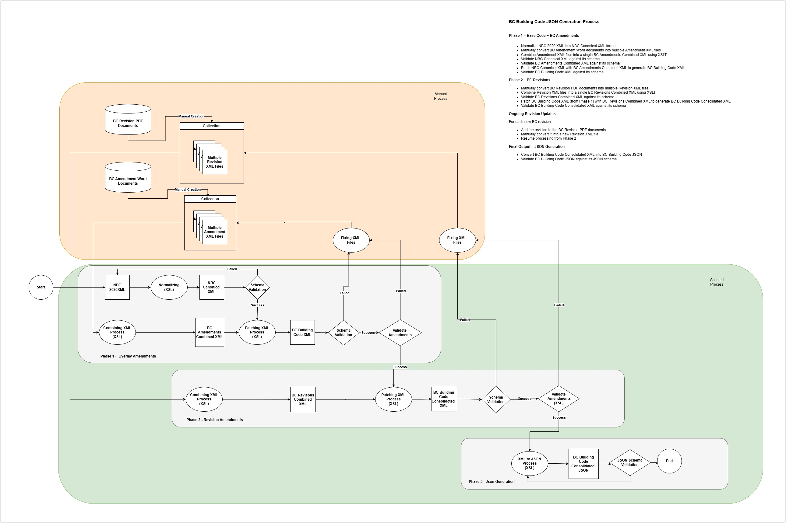

## BUILD.md 
### Instructions for building and validation a new BC Building code JSON file

#### Process overview - how the BCBC JSON file gets created in the first place

The BCBC.json file ```BuildingCode.json``` gets built through transforming the NBC XML file in ```json-generation-pipeline\source\nbc-2020-xml``` , applying amendments in word documents and xml documents in ```json-generation-pipeline\source\bc-amendments``` and applying revisions from ministerial orders in ```json-generation-pipeline\source\bc-revisions``` 

The architecture is shown below 

The process involves multiple XSLT transformations using the Oxygen XML tool which can be automated through calling the Oxygen API through Java command-line calls. This process is well documented in  [json-generation-pipeline\docs\README.md](json-generation-pipeline\docs\README.md)

Note that the development process creates a new BCBC JSON in location ```BC-Building-Code/json-generation-pipeline/output/bc-building-code.json``` , as well as a schema change (if applicable) to file ```BC-Building-Code/json-generation-pipeline/output/bc-building-code-schema.json```. It is necessary to copy these files manually to ```BuildingCode.json``` and ```schema.json``` resp.  The best way to do this is to check out the ```BuildingCode.json``` and ```schema.json``` files on a 
branch off the ```develop``` branch (probably the same branch you used to generate the new JSON file) and replace the content with that of the generated file  ```BC-Building-Code/json-generation-pipeline/output/bc-building-code.json``` and ```BC-Building-Code/json-generation-pipeline/output/bc-building-code-schema.json``` resp. ,then raise a PR to merge the files to the develop branch. 


#### BCBC JSON file validation 

Once a new JSON file has been generated, it needs to be validated. This process is described in [docs\VALIDATION_PIPELINE.md](docs\VALIDATION_PIPELINE.md). 

The validation process is run when a merge attempt at a pull request is performed onto the dev branch. Hence the need to do development work on the JSON file on a branch OFF the develop branch, then open a PR to merge back onto the dev branch. 

#### Using the new BCBC JSON file

Most likely the next integration point will be using the newly generated and validated JSON files (schema and content)  in the BCBC Viewer. There are 2 possibilities - the first being an UPGRADE of the existing BCBC JSON schema and content files (for example , correcting an error , or adding a new amendment ), the second being the addition of a completely new version of the  BCBC JSON to co-exist with the existing version (selectable in the UI). For the former,  the easiest way to achieve this is to replace the existing BCBC JSON and schema files in the repo https://github.com/bcgov/HOUS-Interactive-BCBC , at the time of writing , these versions were called [bcbc-2024.json](https://github.com/bcgov/HOUS-Interactive-BCBC/blob/develop/data/source/bcbc-2024.json) and [bc-building-code-schema.json](https://github.com/bcgov/HOUS-Interactive-BCBC/blob/develop/data/source/bc-building-code-schema.json) resp. - but they may have been replaced with later versions - so check out the current version in file [versions.json](https://github.com/bcgov/HOUS-Interactive-BCBC/blob/develop/data/source/versions.json)
Check out this file on the develop branch, replace the content with the new file and commit it. 

Instructions for achieving the second goal are contained here https://github.com/bcgov/HOUS-Interactive-BCBC/blob/develop/docs/HOW-TO-ADD-NEW-VERSION.md