# Oxygen XML Editor - User Guide for BC Building Code Pipeline

A comprehensive guide for using Oxygen XML Editor to edit BC Building Code amendments and generate JSON output through a visual interface.

---

## Table of Contents

1. [What is Oxygen XML Editor?](#1-what-is-oxygen-xml-editor)
2. [Installation and Setup](#2-installation-and-setup)
3. [Opening the BC Building Code Project](#3-opening-the-bc-building-code-project)
4. [Importing Transformation Scenarios](#4-importing-transformation-scenarios)
5. [Understanding the Oxygen Interface](#5-understanding-the-oxygen-interface)
6. [Editing Amendment Files](#6-editing-amendment-files)
   - 6.6 [Schema Validation with RELAX NG](#66-schema-validation-with-relax-ng)
7. [Creating New Amendment Files](#7-creating-new-amendment-files)
8. [Running Transformation Scenarios](#8-running-transformation-scenarios)
9. [Viewing Validation Reports](#9-viewing-validation-reports)
10. [Troubleshooting Common Issues](#10-troubleshooting-common-issues)
11. [Best Practices](#11-best-practices)

---

## 1. What is Oxygen XML Editor?

Oxygen XML Editor is a professional XML development tool that provides:

- **Visual XML editing** with syntax highlighting and validation
- **XSLT transformation** execution with one-click scenarios
- **Project management** for organizing files and resources
- **Validation** against XML schemas (RELAX NG, XSD)
- **Intelligent code completion** for XML elements and attributes
- **Built-in Saxon processor** for XSLT 3.0 transformations

### Why Use Oxygen for BC Building Code?

- **No command-line required** - All transformations run through the UI
- **Instant validation** - See errors as you type
- **One-click pipeline** - Run entire transformation pipeline with pre-configured scenarios
- **Visual diff** - Compare XML files side-by-side
- **Professional editing** - Auto-formatting, code folding, and smart indentation

---

## 2. Installation and Setup

### 2.1 System Requirements

- **Operating System:** Windows, macOS, or Linux
- **Java:** Java 8 or newer (included with Oxygen installer)
- **RAM:** Minimum 4 GB (8 GB recommended for large files)
- **Disk Space:** 500 MB for Oxygen + 2 GB for project files

### 2.2 Installing Oxygen XML Editor

For detailed installation instructions for your operating system, please refer to the official Oxygen XML Editor installation guide:

**Official Installation Guide:** https://www.oxygenxml.com/doc/versions/28.0/ug-editor/topics/installation-intro.html

**Key Points:**
- Download **Oxygen XML Editor** (not Author or Developer) from https://www.oxygenxml.com/
- 30-day free trial available
- Java is included with the installer (no separate installation needed)
- Choose the installer appropriate for your operating system (Windows, macOS, or Linux)

### 2.3 First Launch and License Activation

1. Launch Oxygen XML Editor
2. Choose license type:
   - **Trial** - 30-day evaluation
   - **License Key** - Enter purchased license
   - **Floating License** - Connect to license server
3. Click "OK" to activate

---

## 3. Opening the BC Building Code Project

### 3.1 Understanding Oxygen Projects

An Oxygen project (`.xpr` file) organizes:
- Source XML files
- XSLT transformation stylesheets
- Transformation scenarios
- Validation schemas
- Project-specific settings

### 3.2 Open the Project File

1. Launch Oxygen XML Editor
2. Go to **Project** menu > **Open Project**
3. Navigate to your BC Building Code repository
4. Select `json-generation-pipeline/oxygen-project/bc-building-code.xpr`
5. Click "Open"

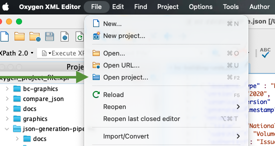

### 3.3 Project View Overview

After opening the project, you'll see the **Project** view on the left side:

```
BCBuildingCode/
├── json-generation-pipeline/
│   ├── source/
│   │   ├── nbc-2020-xml/
│   │   ├── bc-amendments/
│   │   │   └── xml/
│   │   └── bc-revisions/
│   │       └── xml/
│   ├── transformation-xslt/
│   ├── output/
│   └── oxygen-scenarios/
```

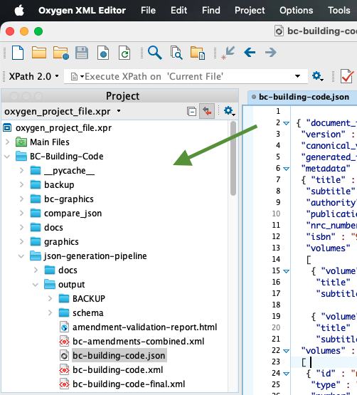

---

## 4. Importing Transformation Scenarios

Transformation scenarios are pre-configured XSLT transformations that run the entire BC Building Code pipeline.

### 4.1 What Are Transformation Scenarios?

The project includes 11 pre-configured scenarios:

1. **NBC to Canonical XML** - Normalize NBC source
2. **Combine BC Amendments** - Merge overlay amendment files
3. **Merge Amendments to NBC** - Apply Phase 1 amendments
4. **Validate Amendments** - Check Phase 1 results
5. **Combine BC Revisions** - Merge revision amendment files
6. **Apply Revisions to BC Building Code** - Apply Phase 2 amendments
7. **Validate Revisions** - Check Phase 2 results
8. **Generate JSON (Full)** - Create full JSON output
9. **Generate JSON (Minimal)** - Create minimal JSON output
10. **Validate JSON Output** - Verify JSON against XML
11. **Compare XML vs JSON Structure** - Check completeness


### 4.2 Import Scenarios Step-by-Step

1. **Open the Scenarios Import Dialog:**
   - Go to **Window** menu > **Show View** > **Transformation Scenarios**
   - Or press `Ctrl+Shift+C` (Windows/Linux) or `Cmd+Shift+C` (macOS)

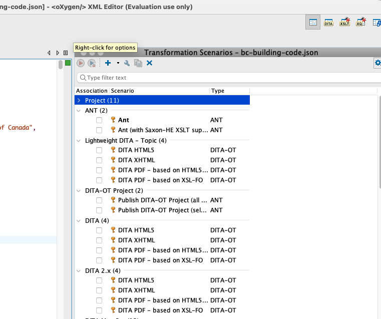

2. **Import the Scenario File:**
   - In the Transformation Scenarios view, click the **Settings** button (gear icon)
   - Select **Import scenarios**
   - Navigate to `json-generation-pipeline/oxygen-scenarios/`
   - Select `scenario.scenarios`
   - Click "Open"

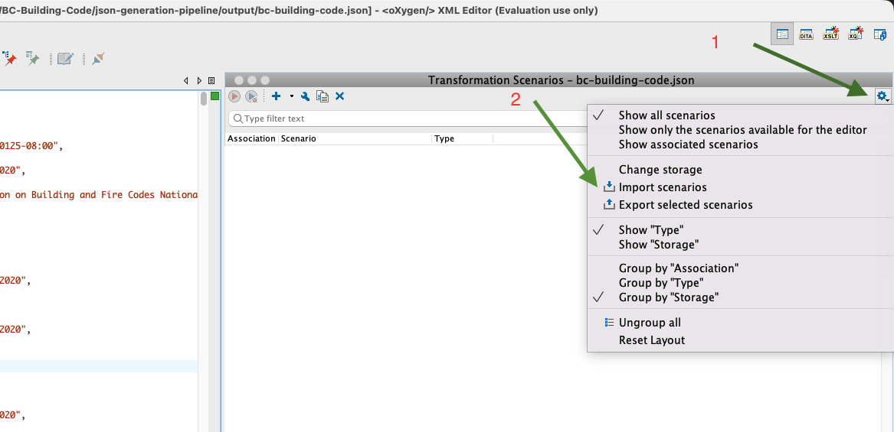

3. **Verify Import:**
   - You should see 11 scenarios listed in the Transformation Scenarios view
   - Each scenario is numbered (1-11) for easy identification

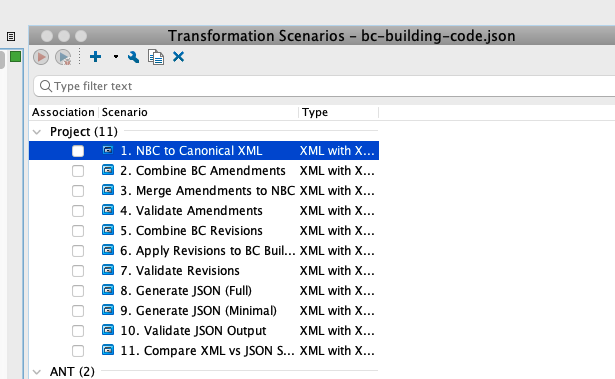

### 4.3 Understanding Scenario Configuration

Each scenario is pre-configured with:
- **Input XML:** Source document to transform
- **XSLT Stylesheet:** Transformation to apply
- **Output:** Where to save the result
- **Parameters:** Additional settings (e.g., overlay-document path)
- **Transformer:** Saxon-PE (XSLT 3.0 processor)

You can view/edit scenario settings by:
1. Right-click on a scenario
2. Select **Edit**
3. Review the configuration tabs

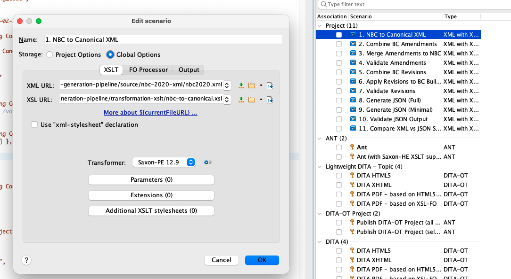

---

## 5. Understanding the Oxygen Interface

### 5.1 Main Interface Components

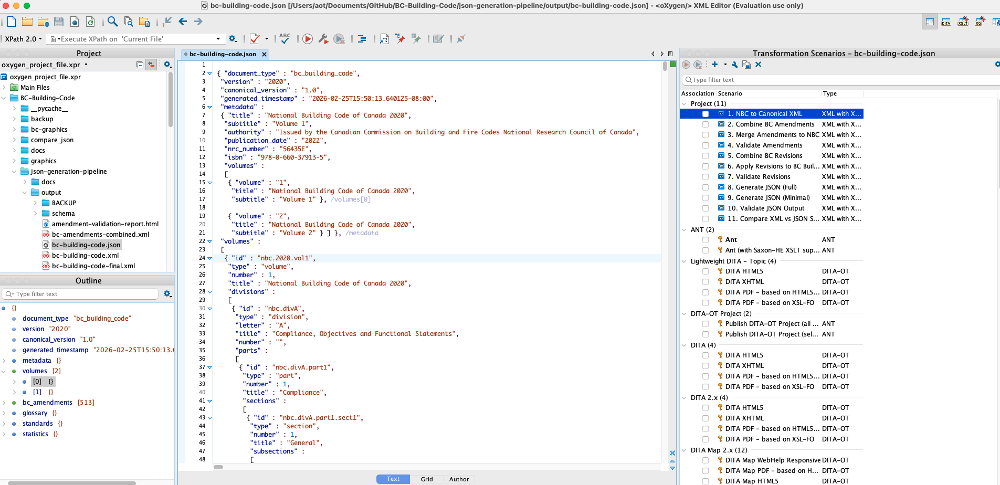

**Key Areas:**

1. **Menu Bar** - Access all Oxygen features
2. **Toolbar** - Quick access to common actions
3. **Project View** (Left) - File browser and project structure
4. **Editor Pane** (Center) - XML editing area with syntax highlighting
5. **Outline View** (Right) - Document structure tree
6. **Transformation Scenarios** (Bottom) - Run transformations
7. **Results** (Bottom) - Validation errors and transformation output

### 5.2 Editor Features

**Syntax Highlighting:**
- Elements in blue
- Attributes in purple
- Values in red
- Comments in gray

**Code Folding:**
- Click the `-` icon next to elements to collapse
- Click the `+` icon to expand

**Auto-Completion:**
- Press `Ctrl+Space` to see available elements/attributes
- Start typing and suggestions appear automatically

**Validation:**
- Red underlines indicate errors
- Yellow underlines indicate warnings
- Hover over underlines to see error messages

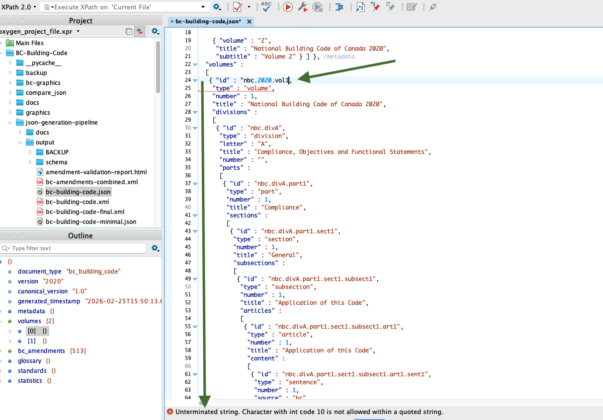

### 5.3 Useful Keyboard Shortcuts

| Action | Windows/Linux | macOS |
|--------|---------------|-------|
| Save | `Ctrl+S` | `Cmd+S` |
| Format and Indent | `Ctrl+Shift+P` | `Cmd+Shift+P` |
| Find | `Ctrl+F` | `Cmd+F` |
| Find in Files | `Ctrl+Shift+F` | `Cmd+Shift+F` |
| Comment/Uncomment | `Ctrl+Shift+,` | `Cmd+Shift+,` |
| Validate | `Ctrl+Shift+V` | `Cmd+Shift+V` |
| Run Transformation | `Ctrl+Shift+T` | `Cmd+Shift+T` |
| Code Completion | `Ctrl+Space` | `Ctrl+Space` |

---

## 6. Editing Amendment Files

### 6.1 Opening an Amendment File

1. In the **Project** view, navigate to:
   - Overlay amendments: `json-generation-pipeline/source/bc-amendments/xml/`
   - Revision amendments: `json-generation-pipeline/source/bc-revisions/xml/`

2. Double-click a file to open it (e.g., `NBC2020p1 Division B Part 3.FIN_1.xml`)

3. The file opens in the editor with syntax highlighting

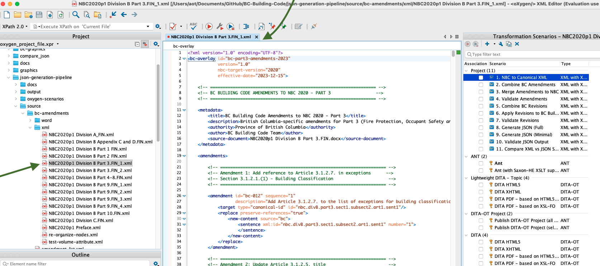


### 6.2 Navigating Large Amendment Files

**Using the Outline View:**
1. The **Outline** view (right side) shows document structure
2. Click on any amendment to jump to it in the editor
3. Use the search box in Outline to find specific amendment IDs

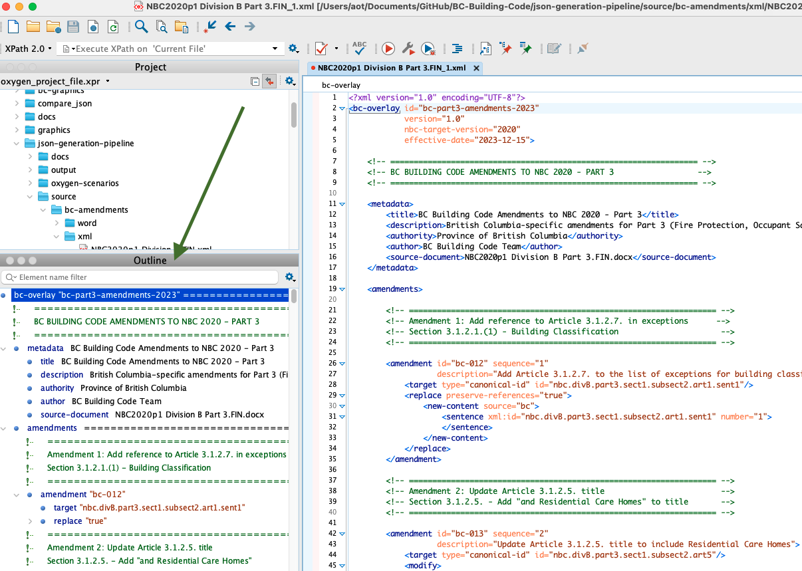

**Using Find:**
1. Press `Ctrl+F` (or `Cmd+F` on macOS)
2. Search for amendment ID (e.g., `bc-048`)
3. Press Enter to jump to next match

**Using Bookmarks:**
1. Right-click on a line number
2. Select **Toggle Bookmark**
3. Use `F2` to jump between bookmarks

### 6.3 Editing an Existing Amendment

**Example: Modify a text-change amendment**

1. Locate the amendment (e.g., `bc-017`)
2. Find the `<find>` and `<replace>` elements
3. Edit the text values
4. Save the file (`Ctrl+S`)

```xml
<amendment id="bc-017" sequence="6"
           description="Change 'required to be' to 'permitted to be'">
    <target type="canonical-id" id="nbc.divB.part3.sect1.subsect4.art2.sent2"/>
    <modify>
        <text-change xpath-within-target="text()">
            <find-replace>
                <find>required to be of</find>
                <replace>permitted to be of</replace>  <!-- Edit this -->
            </find-replace>
        </text-change>
    </modify>
</amendment>
```

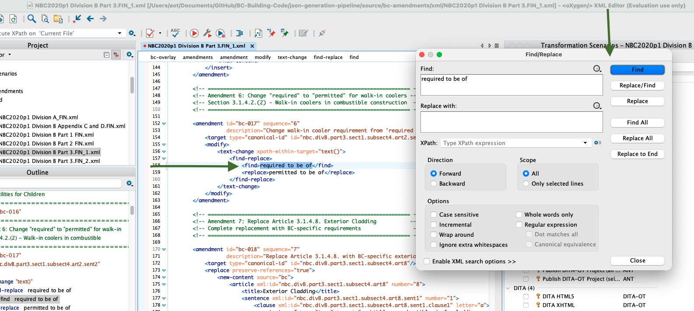

### 6.4 Validating Your Changes

**Automatic Validation:**
- Oxygen validates as you type
- Errors appear with red underlines
- Warnings appear with yellow underlines

**Manual Validation:**
1. Press `Ctrl+Shift+V` (or `Cmd+Shift+V` on macOS)
2. Or click the **Validate** button in the toolbar
3. Check the **Results** pane at the bottom for errors

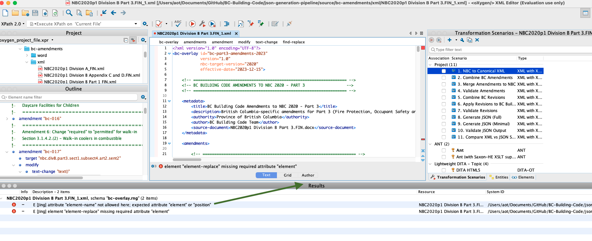

**Common Validation Errors:**
- Missing required attributes
- Invalid element structure
- Unclosed tags
- Invalid ID references

### 6.5 Formatting and Indentation

After editing, format the XML for readability:

1. Press `Ctrl+Shift+P` (or `Cmd+Shift+P` on macOS)
2. Or go to **Document** menu > **Source** > **Format and Indent**
3. The entire document is auto-formatted with proper indentation

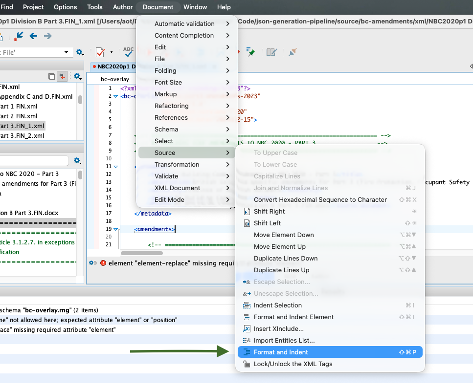

### 6.6 Schema Validation with RELAX NG

The BC Building Code pipeline uses **RELAX NG schemas** to validate XML structure. Oxygen can validate your files against these schemas to catch errors before running transformations.

#### What Are RELAX NG Schemas?

RELAX NG (REgular LAnguage for XML Next Generation) is a schema language that defines:
- Valid element names and hierarchy
- Required and optional attributes
- Content models (what can go inside elements)
- Data types for attribute values

#### Available Schemas

The project includes two RELAX NG schemas:

| Schema | Purpose | Validates |
|--------|---------|-----------|
| `bc-overlay.rng` | Amendment files | Overlay and revision amendment XML files |
| `canonical-nbc.rng` | Output structure | Canonical NBC and BC Building Code XML files |

**Schema Locations:**
- `json-generation-pipeline/output/schema/bc-overlay.rng`
- `json-generation-pipeline/output/schema/canonical-nbc.rng`

#### Associating a Schema with Your File

**Method 1: Automatic Association (Recommended)**

Oxygen can auto-detect schemas if your XML file includes a schema reference:

```xml
<?xml version="1.0" encoding="UTF-8"?>
<?xml-model href="../../output/schema/bc-overlay.rng" type="application/xml" 
            schematypens="http://relaxng.org/ns/structure/1.0"?>
<bc-overlay id="bc-my-amendments" version="1.0" nbc-target-version="2020">
    ...
</bc-overlay>
```

**Method 2: Manual Association**

1. Open your amendment file in Oxygen
2. Go to **Document** menu > **Schema** > **Associate Schema**
3. Click **Browse** next to "URL"
4. Navigate to `json-generation-pipeline/output/schema/`
5. Select `bc-overlay.rng`
6. Set "Schema type" to **RELAX NG**
7. Click "OK"

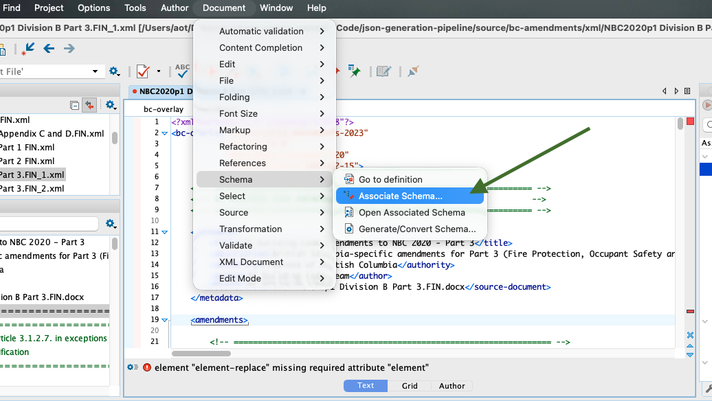

#### Validating Amendment Files

**What to Validate:**

| File Type | Schema | Location |
|-----------|--------|----------|
| Overlay amendments | `bc-overlay.rng` | `source/bc-amendments/xml/*.xml` |
| Revision amendments | `bc-overlay.rng` | `source/bc-revisions/xml/*.xml` |
| NBC Canonical | `canonical-nbc.rng` | `output/nbc-canonical.xml` |
| BC Building Code | `canonical-nbc.rng` | `output/bc-building-code.xml` |
| BC Building Code Final | `canonical-nbc.rng` | `output/bc-building-code-final.xml` |

**Step-by-Step Validation:**

1. **Open the file** you want to validate
2. **Associate the schema** (if not already associated)
3. **Run validation:**
   - Press `Ctrl+Shift+V` (or `Cmd+Shift+V` on macOS)
   - Or click the **Validate** button in toolbar
   - Or go to **Document** menu > **Validate** > **Validate**

4. **Check results** in the **Results** pane at the bottom


#### Understanding Schema Validation Errors

**Common Error Types:**

**1. Element Not Allowed**
```
Error: element "paragraph" not allowed here; expected element "text"
```
**Cause:** Wrong element in the hierarchy  
**Fix:** Check the canonical schema structure - use correct element name

**2. Missing Required Attribute**
```
Error: element "amendment" missing required attribute "id"
```
**Cause:** Forgot a required attribute  
**Fix:** Add the missing attribute (e.g., `id="bc-001"`)

**3. Invalid Attribute Value**
```
Error: value of attribute "type" is invalid; must be equal to "replace", "insert", "modify", or "delete"
```
**Cause:** Typo or invalid value  
**Fix:** Use one of the allowed values

**4. Element in Wrong Context**
```
Error: element "sentence" not allowed here; expected element "article"
```
**Cause:** Element placed at wrong level in hierarchy  
**Fix:** Move element to correct parent (e.g., sentences go inside articles)

**5. Invalid ID Format**
```
Error: value of attribute "xml:id" is invalid; must match pattern "nbc\.div[A-C]\.part\d+\..*"
```
**Cause:** ID doesn't follow canonical format  
**Fix:** Use correct hierarchical ID format (e.g., `nbc.divB.part3.sect1.art1`)

#### Validating Overlay Amendment Files

**For files in `source/bc-amendments/xml/` and `source/bc-revisions/xml/`:**

1. Open the amendment file
2. Associate with `bc-overlay.rng` schema
3. Validate (`Ctrl+Shift+V`)
4. Fix any errors shown in Results pane

**Example Amendment Validation:**

```xml
<?xml version="1.0" encoding="UTF-8"?>
<?xml-model href="../../output/schema/bc-overlay.rng" type="application/xml" 
            schematypens="http://relaxng.org/ns/structure/1.0"?>
<bc-overlay id="bc-part3-amendments" version="1.0" nbc-target-version="2020">
    <metadata>
        <title>BC Part 3 Amendments</title>
        <description>BC-specific amendments for Part 3</description>
        <authority>BC Ministry of Housing</authority>
        <author>BC Building Code Team</author>
        <source-document>BC Building Code 2024</source-document>
    </metadata>
    <amendments>
        <amendment id="bc-001" sequence="1" description="Replace sentence">
            <target type="canonical-id" id="nbc.divB.part3.sect1.art1.sent1"/>
            <replace preserve-references="false">
                <new-content source="bc">
                    <sentence xml:id="nbc.divB.part3.sect1.art1.sent1" number="1">
                        <text>New BC-specific text...</text>
                    </sentence>
                </new-content>
            </replace>
        </amendment>
    </amendments>
</bc-overlay>
```

**Validation checks:**
- ✓ `<bc-overlay>` has required attributes (`id`, `version`, `nbc-target-version`)
- ✓ `<metadata>` contains all required child elements
- ✓ `<amendment>` has required attributes (`id`, `sequence`, `description`)
- ✓ `<target>` has correct `type` and required attributes
- ✓ Operation (`<replace>`, `<insert>`, `<modify>`, `<delete>`) is valid
- ✓ `<new-content>` contains valid canonical elements

#### Validating Output Files

**For files in `output/` folder:**

1. Open the output file (e.g., `bc-building-code.xml`)
2. Associate with `canonical-nbc.rng` schema
3. Validate (`Ctrl+Shift+V`)
4. Check for structural errors

**Example Canonical XML Validation:**

```xml
<?xml version="1.0" encoding="UTF-8"?>
<?xml-model href="schema/canonical-nbc.rng" type="application/xml" 
            schematypens="http://relaxng.org/ns/structure/1.0"?>
<nbc version="2020">
    <division xml:id="nbc.divB" letter="B" volume="1">
        <title>Acceptable Solutions</title>
        <number>Division B</number>
        <part xml:id="nbc.divB.part3" number="3">
            <title>Fire Protection, Occupant Safety and Accessibility</title>
            <section xml:id="nbc.divB.part3.sect1" number="1">
                <title>General</title>
                <!-- More content -->
            </section>
        </part>
    </division>
</nbc>
```

**Validation checks:**
- ✓ Root element is `<nbc>` with `version` attribute
- ✓ Hierarchy follows: division → part → section → subsection → article → sentence
- ✓ All elements have required `xml:id` attributes
- ✓ IDs follow canonical format (`nbc.divB.part3...`)
- ✓ Elements have required attributes (`letter`, `volume`, `number`, etc.)
- ✓ `<ref>` elements have valid `type` and `target` attributes

#### Schema Validation vs. Transformation Validation

**Two Types of Validation:**

| Type | What It Checks | When to Use |
|------|----------------|-------------|
| **Schema Validation** | XML structure, element names, attributes, hierarchy | Before running transformations |
| **Transformation Validation** | Amendment application, target existence, text matching | After running transformations |

**Workflow:**

1. **Edit amendment file**
2. **Schema validate** (`Ctrl+Shift+V`) - Check structure
3. **Fix schema errors** - Correct XML structure
4. **Run transformation** (Scenario 2 or 5) - Combine amendments
5. **Run validation scenario** (Scenario 4 or 7) - Check application
6. **Review HTML report** - Fix any warnings/errors

#### Common Schema Validation Scenarios

**Scenario 1: New Amendment File**
```
1. Create new amendment file
2. Add schema reference: <?xml-model href="../../output/schema/bc-overlay.rng"?>
3. Validate (Ctrl+Shift+V)
4. Fix any structural errors
5. Save and proceed to transformation
```

**Scenario 2: Editing Existing Amendment**
```
1. Open amendment file
2. Make changes
3. Validate (Ctrl+Shift+V) - Check structure is still valid
4. Fix any errors introduced
5. Save
```

**Scenario 3: Validating Output**
```
1. Run transformation (e.g., Scenario 3: Merge Amendments)
2. Open output file (bc-building-code.xml)
3. Associate with canonical-nbc.rng
4. Validate (Ctrl+Shift+V)
5. Check for structural issues in merged output
```

#### Tips for Schema Validation

**Best Practices:**

1. **Validate early and often** - Check structure before running transformations
2. **Fix errors immediately** - Don't accumulate validation errors
3. **Use auto-completion** - Press `Ctrl+Space` to see valid elements/attributes
4. **Check schema documentation** - Review schema files for allowed structures
5. **Validate after major edits** - Always validate after restructuring content

**Performance Tips:**

- Schema validation is fast (< 1 second for most files)
- Validate individual files rather than entire project
- Keep schema files in project for quick access

**Troubleshooting Schema Validation:**

| Problem | Solution |
|---------|----------|
| Schema not found | Check file path in `<?xml-model?>` processing instruction |
| Validation doesn't run | Ensure schema is associated (Document > Schema > Associate Schema) |
| Too many errors | Fix first error, then re-validate (errors cascade) |
| Schema seems wrong | Verify you're using correct schema (overlay vs. canonical) |

---

## 7. Creating New Amendment Files

### 7.1 Using a Template

1. **Copy an Existing Amendment File:**
   - Right-click on an existing amendment file in Project view
   - Select **Copy**
   - Right-click on the target folder
   - Select **Paste**
   - Rename the file

2. **Modify the Template:**
   - Update the `<bc-overlay>` `id` attribute
   - Update `<metadata>` section (title, description, author)
   - Remove existing amendments
   - Add your new amendments

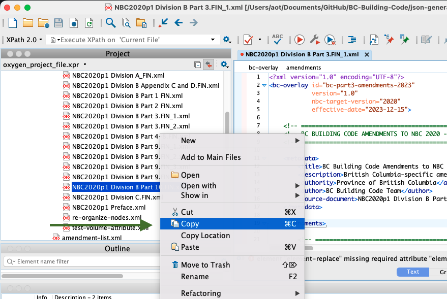

### 7.2 Amendment File Structure

```xml
<?xml version="1.0" encoding="UTF-8"?>
<bc-overlay id="bc-my-amendments" version="1.0"
            nbc-target-version="2020" effective-date="2025-03-01">
    <metadata>
        <title>My BC Building Code Amendments</title>
        <description>Description of changes</description>
        <authority>BC Ministry of Housing</authority>
        <author>Your Name</author>
        <source-document>Source reference</source-document>
    </metadata>
    <amendments>
        <!-- Add amendments here -->
    </amendments>
</bc-overlay>
```

### 7.3 Adding a New Amendment

**Example: Replace a sentence**

1. Add a new `<amendment>` element inside `<amendments>`
2. Set unique `id` and `sequence` number
3. Define the `<target>` element
4. Add the operation (`<replace>`, `<insert>`, `<modify>`, or `<delete>`)
5. Include `<new-content>` with your changes

```xml
<amendment id="bc-new-001" sequence="100"
           description="Replace sentence with BC requirement">
    <target type="canonical-id" id="nbc.divB.part3.sect1.subsect1.art1.sent1"/>
    <replace preserve-references="false">
        <new-content source="bc">
            <sentence xml:id="nbc.divB.part3.sect1.subsect1.art1.sent1" number="1">
                <text>New BC-specific text here...</text>
            </sentence>
        </new-content>
    </replace>
</amendment>
```

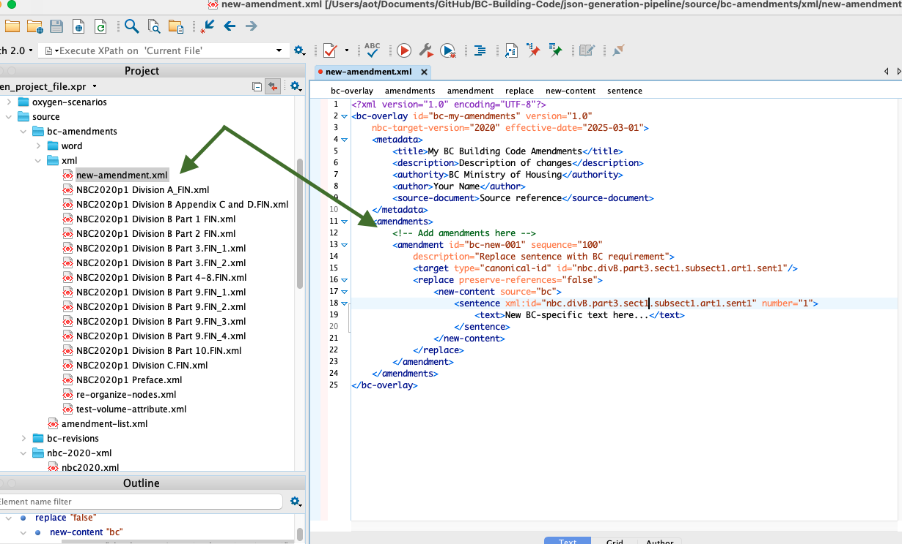

### 7.4 Using Code Templates (Snippets)

Oxygen supports code templates for faster editing:

1. Go to **Options** menu > **Preferences**
2. Navigate to **Editor** > **Content Completion** > **Code Templates**
3. Click **New** to create a template
4. Define template name and content

**Example Template for Replace Amendment:**

```xml
<amendment id="${id}" sequence="${sequence}"
           description="${description}">
    <target type="canonical-id" id="${target-id}"/>
    <replace preserve-references="false">
        <new-content source="bc">
            ${cursor}
        </new-content>
    </replace>
</amendment>
```

Type the template name and press `Ctrl+Space` to insert.

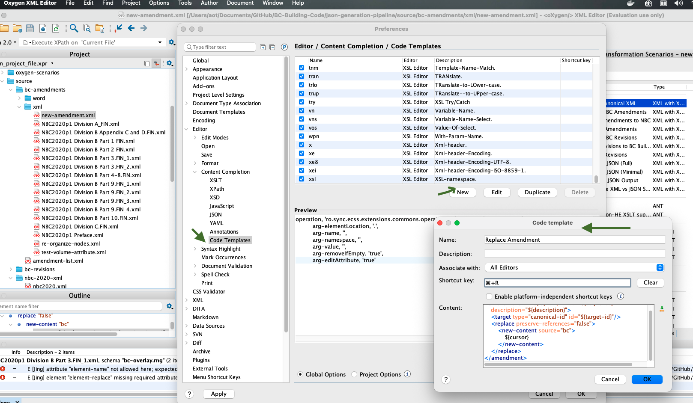


---

## 8. Running Transformation Scenarios

### 8.1 Running a Single Scenario

**Method 1: From Transformation Scenarios View**

1. Open the **Transformation Scenarios** view (bottom panel)
2. Select the scenario you want to run (e.g., "2. Combine BC Amendments")
3. Click the **Apply associated** button (play icon)
4. Watch the progress in the **Results** pane
5. Output file opens automatically when complete

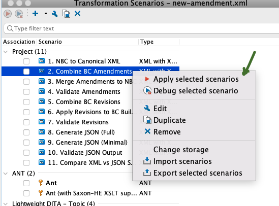

**Method 2: From Toolbar**

1. Click the **Configure Transformation Scenario(s)** button in toolbar
2. Select a scenario from the list
3. Click **Apply associated**

**Method 3: Keyboard Shortcut**

1. Press `Ctrl+Shift+T` (or `Cmd+Shift+T` on macOS)
2. Select scenario from the list
3. Press Enter

### 8.2 Running the Complete Pipeline

To generate the final JSON output, run scenarios in order:

**Phase 0: Normalization (One-time)**
1. Run **"1. NBC to Canonical XML"**
   - Input: `nbc2020.xml`
   - Output: `nbc-canonical.xml`
   - Time: ~10 seconds

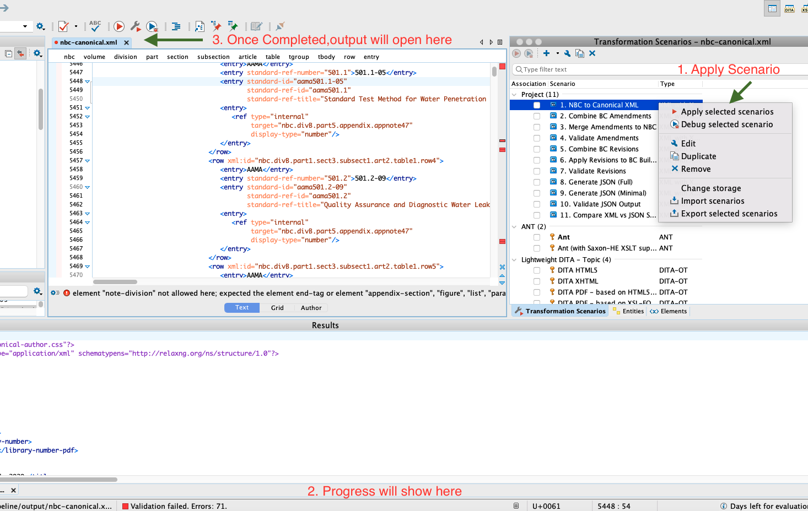

**Phase 1: Overlay Amendments**

2. Run **"2. Combine BC Amendments"**
   - Input: `amendment-list.xml`
   - Output: `bc-amendments-combined.xml`
   - Time: ~5 seconds

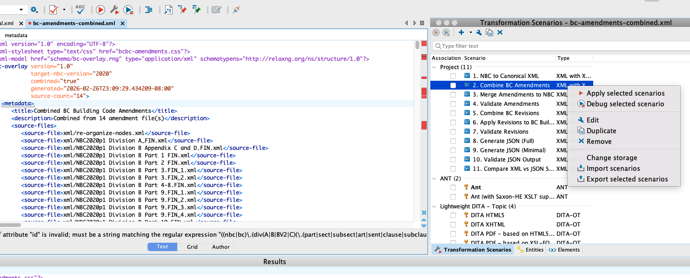

3. Run **"3. Merge Amendments to NBC"**
   - Input: `nbc-canonical.xml` + `bc-amendments-combined.xml`
   - Output: `bc-building-code.xml`
   - Time: ~10 seconds

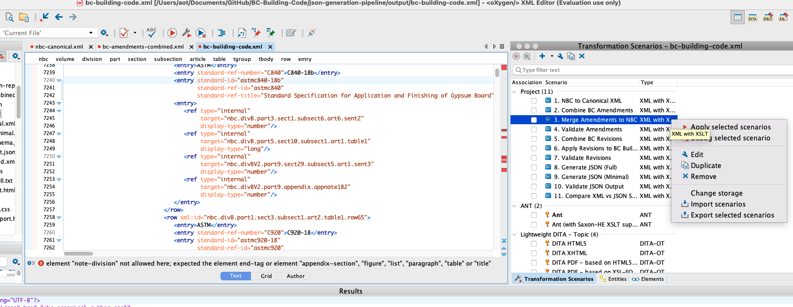

4. Run **"4. Validate Amendments"**
   - Input: `bc-amendments-combined.xml`
   - Output: `amendment-validation-report.html`
   - Opens in browser automatically

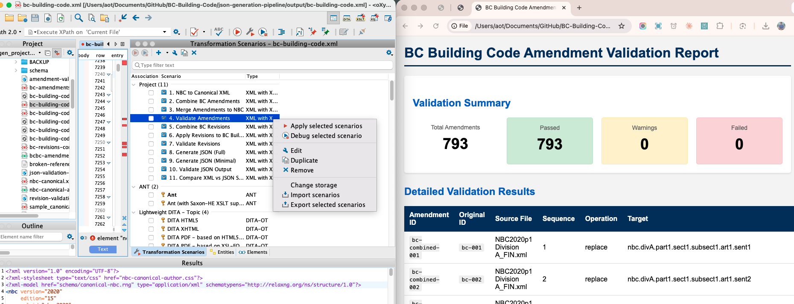

**Phase 2: Revision Amendments**

5. Run **"5. Combine BC Revisions"**
   - Input: `revision-list.xml`
   - Output: `bc-revisions-combined.xml`
   - Time: ~2 seconds

6. Run **"6. Apply Revisions to BC Building Code"**
   - Input: `bc-building-code.xml` + `bc-revisions-combined.xml`
   - Output: `bc-building-code-final.xml`
   - Time: ~10 seconds

7. Run **"7. Validate Revisions"**
   - Input: `bc-revisions-combined.xml`
   - Output: `revision-validation-report.html`
   - Opens in browser automatically

**Phase 3: JSON Generation**

8. Run **"8. Generate JSON (Full)"**
   - Input: `bc-building-code-final.xml`
   - Output: `bc-building-code.json`
   - Time: ~5 seconds

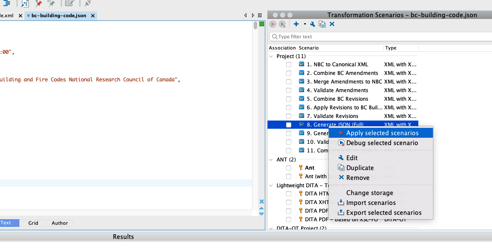

9. (Optional) Run **"9. Generate JSON (Minimal)"**
   - Input: `bc-building-code-final.xml`
   - Output: `bc-building-code-minimal.json`
   - Time: ~5 seconds

**Phase 4: Validation**

10. Run **"10. Validate JSON Output"**
    - Input: `bc-building-code-final.xml` + `bc-building-code.json`
    - Output: `json-validation-report.html`
    - Opens in browser automatically

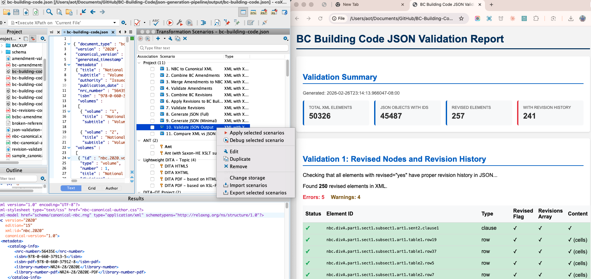

11. Run **"11. Compare XML vs JSON Structure"**
    - Input: `bc-building-code-final.xml` + `bc-building-code.json`
    - Output: `structure-comparison-report.html`
    - Opens in browser automatically

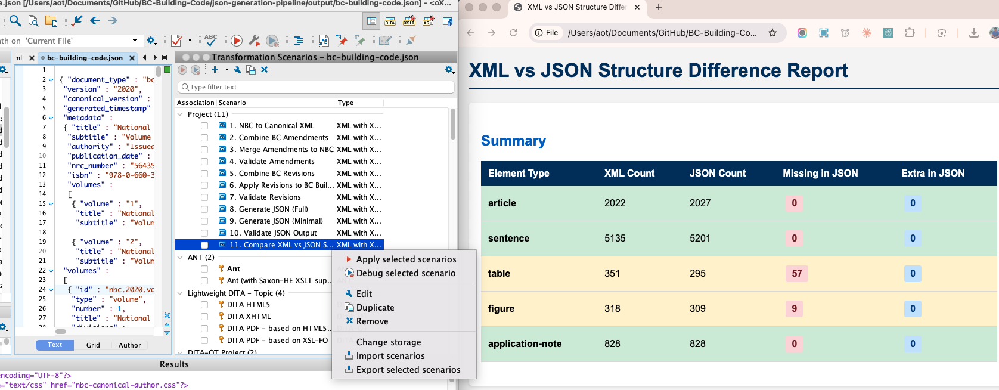

### 8.3 Monitoring Transformation Progress

**Progress Indicators:**
- Progress bar shows transformation status
- **Results** pane displays real-time messages
- Estimated time remaining shown in status bar

**Transformation Messages:**
- `INFO` - Informational messages
- `WARNING` - Non-critical issues
- `ERROR` - Critical problems that stop transformation

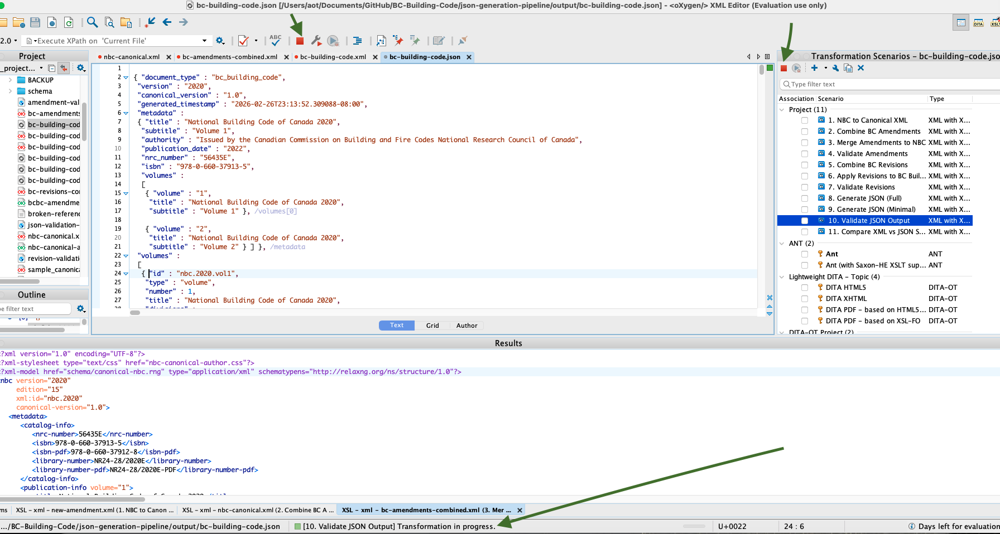

### 8.4 Viewing Transformation Output

**XML Output:**
- Opens automatically in a new editor tab
- Syntax highlighted and formatted
- Can be validated immediately

**HTML Reports:**
- Open automatically in default browser
- Interactive reports with color-coded results
- Can be saved for documentation

**JSON Output:**
- Opens in Oxygen's JSON editor
- Syntax highlighted
- Can be validated against JSON schema

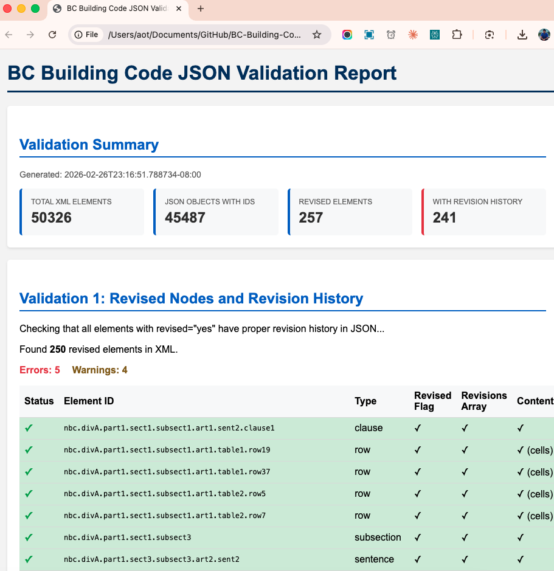

---

## 9. Viewing Validation Reports

### 9.1 Amendment Validation Report

After running **"4. Validate Amendments"** or **"7. Validate Revisions"**, an HTML report opens in your browser.

**Report Sections:**

1. **Summary Statistics**
   - Total amendments processed
   - Successful applications
   - Warnings count
   - Errors count

2. **Amendment Details Table**
   - Amendment ID
   - Status (✓ Success, ⚠ Warning, ✗ Error)
   - Target element
   - Message

3. **Warnings Section**
   - "Modified text not found exactly" warnings
   - Suggestions for fixes

4. **Errors Section**
   - Target element not found
   - Invalid operations
   - Schema violations

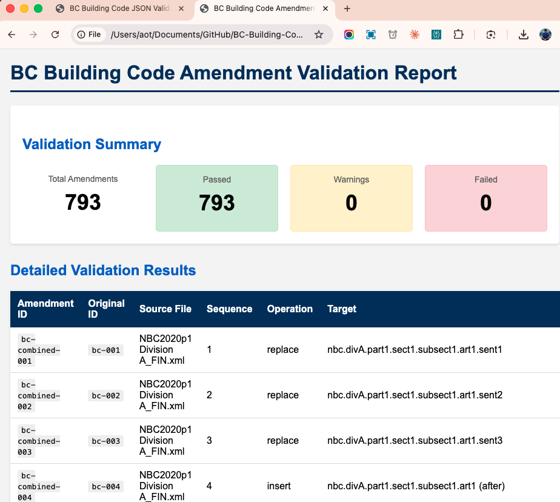


### 9.2 JSON Validation Report

After running **"10. Validate JSON Output"**, an HTML report opens showing:

**Validation Categories:**

1. **Revised Nodes and Revision History**
   - Elements with `revised="yes"` attribute
   - Presence of `revisions` array in JSON
   - Content completeness check

2. **Structure Completeness**
   - Element count comparison (XML vs JSON)
   - Divisions, parts, sections, subsections, articles, sentences
   - Tables, figures, application-notes

3. **Content Completeness**
   - Empty text fields
   - Empty content fields
   - Missing required data

4. **Cross-References**
   - Broken internal references
   - Invalid target IDs
   - Exports `broken-references-full.txt` if issues found

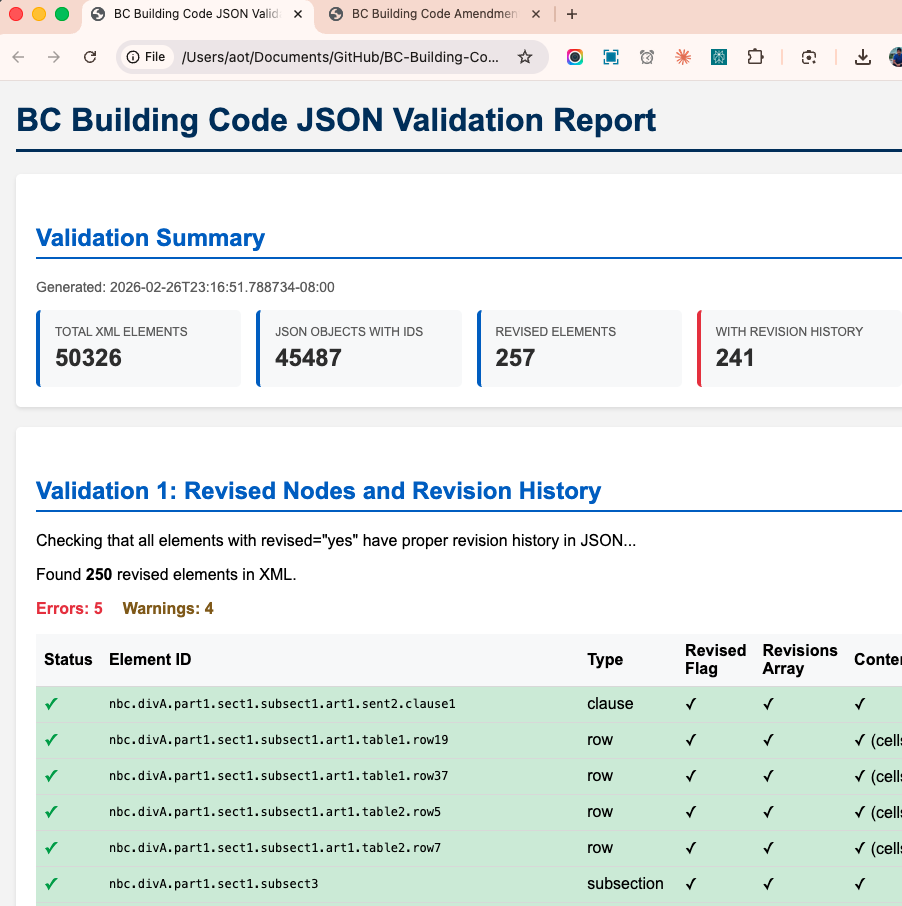

### 9.3 Structure Comparison Report

After running **"11. Compare XML vs JSON Structure"**, an HTML report shows:

**Summary Table:**
- Element type
- XML count
- JSON count
- Missing in JSON
- Extra in JSON

**Detailed Sections:**
- Lists all missing IDs
- Lists all extra IDs
- Organized by element type

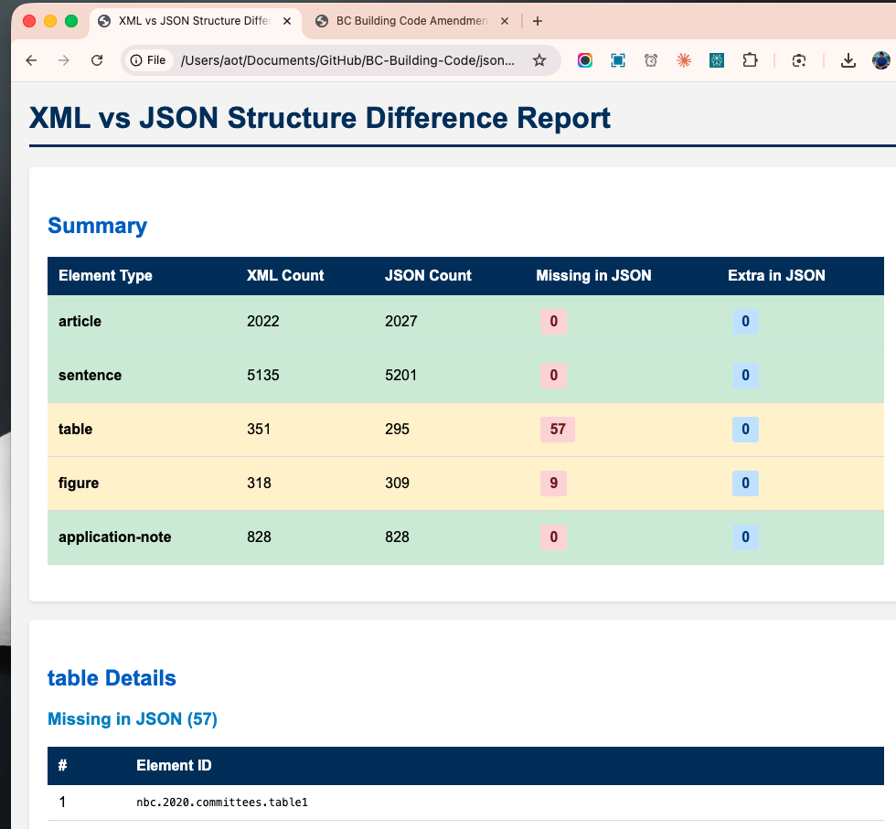

### 9.4 Interpreting Validation Results

**Success Indicators:**
- ✓ Green checkmarks
- "All validations passed"
- Zero errors and warnings

**Warning Indicators:**
- ⚠ Yellow warning icons
- "Modified text not found exactly"
- Non-critical issues that don't stop processing

**Error Indicators:**
- ✗ Red error icons
- "Target element not found"
- Critical issues requiring fixes

**Next Steps After Validation:**
1. **If all green:** Proceed to next phase
2. **If warnings:** Review and decide if acceptable
3. **If errors:** Fix amendments and re-run validation

---

## 10. Troubleshooting Common Issues

### 10.1 Transformation Fails to Start

**Problem:** Clicking "Apply associated" does nothing

**Solutions:**
1. Check that Saxon-PE is configured:
   - Go to **Options** > **Preferences** > **XML** > **XSLT-FO-XQuery** > **XSLT**
   - Verify "Saxon-PE" is in the list
2. Restart Oxygen XML Editor
3. Re-import transformation scenarios

### 10.2 "File Not Found" Errors

**Problem:** Transformation fails with "Cannot find file" error

**Solutions:**
1. Verify project is opened from correct location
2. Check that `${pdu}` variable resolves correctly:
   - Go to **Options** > **Preferences** > **Editor Variables**
   - `${pdu}` should point to project root
3. Ensure all input files exist in expected locations
4. Run scenarios in correct order (dependencies)

### 10.3 Out of Memory Errors

**Problem:** "Java heap space" or "Out of memory" error

**Solutions:**
1. Increase Java heap size:
   - Go to **Options** > **Preferences** > **Memory**
   - Increase "Maximum memory available to the application"
   - Recommended: 4096 MB (4 GB) or higher
2. Restart Oxygen after changing memory settings
3. Close unused editor tabs before running transformations

### 10.4 Validation Errors in Amendment Files

**Problem:** Red underlines in XML editor

**Common Causes and Fixes:**

| Error | Cause | Fix |
|-------|-------|-----|
| "Element not allowed here" | Wrong element in hierarchy | Check canonical schema structure |
| "Attribute not allowed" | Invalid attribute name | Verify attribute spelling |
| "ID already exists" | Duplicate xml:id | Use unique IDs |
| "Invalid ID reference" | Target doesn't exist | Verify target ID in source XML |
| "Missing required attribute" | Forgot required attribute | Add missing attribute |

### 10.5 Transformation Takes Too Long

**Problem:** Transformation runs for several minutes

**Normal Processing Times:**
- NBC to Canonical: ~10 seconds
- Combine Amendments: ~5 seconds
- Merge Amendments: ~10 seconds
- Generate JSON: ~5 seconds

**If Slower:**
1. Check system resources (CPU, RAM usage)
2. Close other applications
3. Increase memory allocation
4. Check for very large amendment files

### 10.6 Output File Not Opening

**Problem:** Transformation completes but output doesn't open

**Solutions:**
1. Check scenario configuration:
   - Right-click scenario > **Edit**
   - Verify "Open in Editor" or "Open in Browser" is checked
2. Manually open output file from Project view
3. Check **Results** pane for error messages

### 10.7 Scenario Import Fails

**Problem:** Cannot import `scenario.scenarios` file

**Solutions:**
1. Verify file path is correct
2. Check file is not corrupted (should be valid XML)
3. Try importing individual scenarios instead of all at once
4. Restart Oxygen and try again

---

## 11. Best Practices

### 11.1 File Organization

**Keep Files Organized:**
- Overlay amendments in `json-generation-pipeline/source/bc-amendments/xml/`
- Revision amendments in `json-generation-pipeline/source/bc-revisions/xml/`
- Never edit files in `output/` folder (they're regenerated)

**Naming Conventions:**
- Use descriptive names: `NBC2020p1 Division B Part 3.FIN_1.xml`
- Include version or date if multiple iterations
- Avoid spaces in filenames (use hyphens or underscores)

### 11.2 Version Control Integration

**Using Git with Oxygen:**
1. Oxygen has built-in Git support
2. Go to **Tools** > **Git Staging** (If not present install Addon for GIT)
3. View changed files, commit, and push

**Before Committing:**

- Run validation scenarios
- Ensure no errors in validation reports
- Format and indent XML files
- Add meaningful commit messages

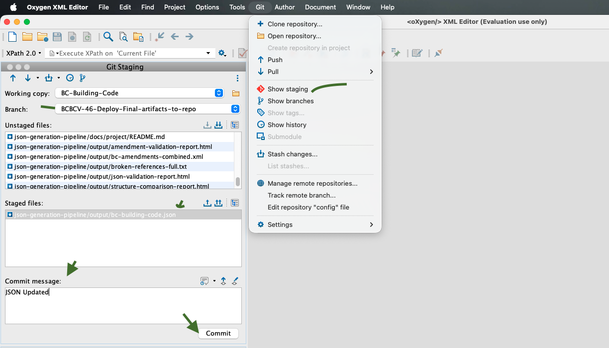

### 11.3 Backup Strategy

**Regular Backups:**
1. Commit changes to Git frequently
2. Keep backup copies of working amendment files
3. Export transformation scenarios periodically:
   - Transformation Scenarios view > Settings > Export scenarios

**Before Major Changes:**
1. Create a Git branch
2. Test changes thoroughly
3. Merge only after validation passes

### 11.4 Performance Optimization

**Speed Up Oxygen:**
1. Close unused editor tabs
2. Disable unnecessary plugins
3. Increase memory allocation
4. Use SSD for project files
5. Keep only one project open at a time

**Speed Up Transformations:**
1. Run scenarios in correct order (avoid re-running earlier steps)
2. Use "Generate JSON (Minimal)" for testing
3. Close large XML files before running transformations

### 11.5 Collaboration Tips

**Working in Teams:**
1. Use consistent amendment ID prefixes per team member
2. Coordinate sequence numbers to avoid conflicts
3. Document changes in amendment descriptions
4. Review validation reports before sharing

**Code Review:**
1. Use Oxygen's **Compare Files** feature:
   - **Tools** > **Compare Files**
   - Select two versions to compare
2. Review changes in side-by-side view
3. Check validation reports together

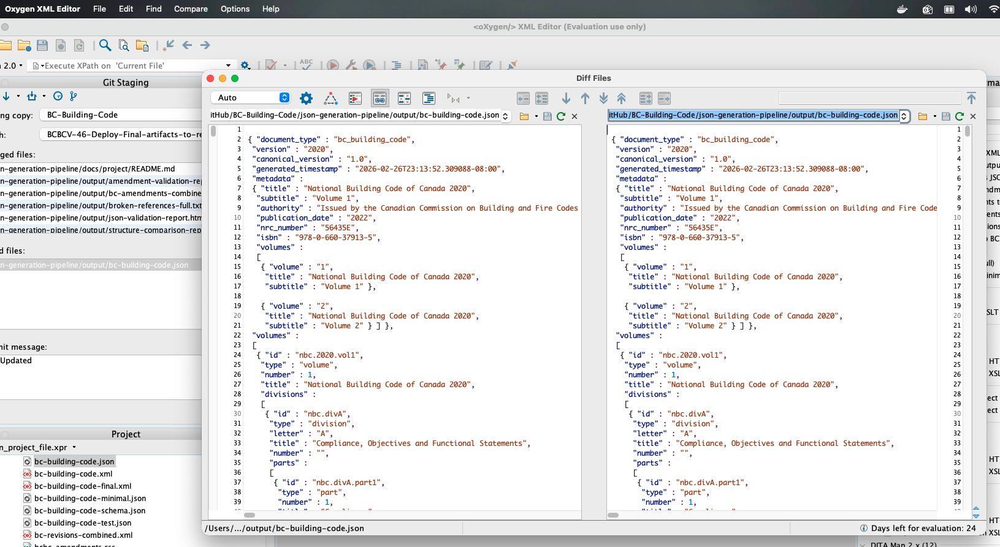

### 11.6 Documentation Habits

**Document Your Work:**
1. Use clear `description` attributes in amendments
2. Add XML comments for complex changes
3. Keep a changelog of major modifications
4. Save validation reports for reference

**Example Comment:**
```xml
<!-- ================================================================== -->
<!-- Amendment 48: Change "each suite" to "a suite"                     -->
<!-- Reason: BC policy requires singular form                           -->
<!-- Date: 2025-02-26                                                   -->
<!-- Author: John Doe                                                   -->
<!-- ================================================================== -->
<amendment id="bc-048" sequence="48"
           description="Change 'each suite' to 'a suite' in Article 3.3.1.1.(1)">
    ...
</amendment>
```

---

## 12. Quick Reference Card

### Essential Shortcuts

| Task | Shortcut |
|------|----------|
| Save | `Ctrl+S` / `Cmd+S` |
| Format XML | `Ctrl+Shift+P` / `Cmd+Shift+P` |
| Validate | `Ctrl+Shift+V` / `Cmd+Shift+V` |
| Run Transformation | `Ctrl+Shift+T` / `Cmd+Shift+T` |
| Find | `Ctrl+F` / `Cmd+F` |
| Find in Files | `Ctrl+Shift+F` / `Cmd+Shift+F` |
| Code Completion | `Ctrl+Space` |
| Comment/Uncomment | `Ctrl+Shift+,` / `Cmd+Shift+,` |

### Transformation Scenario Order

1. NBC to Canonical XML (one-time)
2. Combine BC Amendments
3. Merge Amendments to NBC
4. Validate Amendments
5. Combine BC Revisions
6. Apply Revisions to BC Building Code
7. Validate Revisions
8. Generate JSON (Full)
9. Validate JSON Output
10. Compare XML vs JSON Structure

### Common Amendment Operations

| Operation | Use For |
|-----------|---------|
| `<replace>` | Swap entire element |
| `<insert>` | Add new content |
| `<modify>` with `<text-change>` | Simple text edits |
| `<modify>` with `<element-replace>` | Text with `<ref>` elements |
| `<delete>` | Remove element (Phase 1) |
| Revision history | Track changes over time (Phase 2) |

---

## 13. Additional Resources

### Oxygen XML Editor Documentation

- **Official Documentation:** https://www.oxygenxml.com/doc/versions/26.0/ug-editor/
- **Video Tutorials:** https://www.oxygenxml.com/demo/
- **Community Forum:** https://www.oxygenxml.com/forum/
- **Support:** support@oxygenxml.com

### BC Building Code Pipeline Documentation

- **System Overview:** `01-system-overview.md`
- **Overlay Amendments Guide:** `02-overlay-amendments-guide.md`
- **Revision Amendments Guide:** `03-revision-amendments-guide.md`
- **Validation Troubleshooting:** `05-validation-troubleshooting.md`
- **Quick Reference:** `06-quick-reference.md`
- **Examples Library:** `07-examples-library.md`

### XSLT and XML Resources

- **XSLT 3.0 Specification:** https://www.w3.org/TR/xslt-30/
- **Saxon Documentation:** https://www.saxonica.com/documentation/
- **XML Tutorial:** https://www.w3schools.com/xml/

---

## 14. Frequently Asked Questions

**Q: Do I need to buy Oxygen XML Editor?**
A: A 30-day trial is available. For continued use, a license is required. Check with your organization for license availability.

**Q: Can I use Oxygen XML Author instead of Editor?**
A: No, Oxygen XML Author is for document authoring. You need Oxygen XML Editor for XSLT transformations.

**Q: What if I don't have Java installed?**
A: Oxygen installers include Java. No separate Java installation needed.

**Q: Can I run transformations from command line instead?**
A: Yes, see the command-line documentation in `06-quick-reference.md`.

**Q: How do I update transformation scenarios?**
A: Re-import the `scenario.scenarios` file. Existing scenarios will be updated.

**Q: Can I edit multiple amendment files at once?**
A: Yes, open multiple files in tabs. Use `Ctrl+Tab` to switch between them.

**Q: What if validation shows many warnings?**
A: Review each warning. Some are informational. Focus on errors first.

**Q: How do I share my transformation scenarios with team members?**
A: Export scenarios (Settings > Export) and share the `.scenarios` file.

**Q: Can Oxygen work with Git?**
A: Yes, Oxygen has built-in Git support. See **Tools** > **Git Staging**.

**Q: What's the difference between Full and Minimal JSON?**
A: Full JSON includes all metadata and annotations. Minimal JSON is smaller with essential content only.

---

## Appendix A: Scenario Configuration Reference

### Scenario 1: NBC to Canonical XML

- **Input:** `json-generation-pipeline/source/nbc-2020-xml/nbc2020.xml`
- **XSLT:** `json-generation-pipeline/transformation-xslt/nbc-to-canonical.xsl`
- **Output:** `json-generation-pipeline/output/nbc-canonical.xml`
- **Parameters:** None
- **Opens:** In editor

### Scenario 2: Combine BC Amendments

- **Input:** `json-generation-pipeline/source/bc-amendments/amendment-list.xml`
- **XSLT:** `json-generation-pipeline/transformation-xslt/combine-amendments.xsl`
- **Output:** `json-generation-pipeline/output/bc-amendments-combined.xml`
- **Parameters:** None
- **Opens:** In editor

### Scenario 3: Merge Amendments to NBC

- **Input:** `json-generation-pipeline/output/nbc-canonical.xml`
- **XSLT:** `json-generation-pipeline/transformation-xslt/merge-engine-v3.xsl`
- **Output:** `json-generation-pipeline/output/bc-building-code.xml`
- **Parameters:** 
  - `overlay-document`: `json-generation-pipeline/output/bc-amendments-combined.xml`
- **Opens:** In editor

### Scenario 4: Validate Amendments

- **Input:** `json-generation-pipeline/output/bc-amendments-combined.xml`
- **XSLT:** `json-generation-pipeline/transformation-xslt/validate-amendments.xsl`
- **Output:** `json-generation-pipeline/output/amendment-validation-report.html`
- **Parameters:**
  - `combined-amendments`: `json-generation-pipeline/output/bc-amendments-combined.xml`
  - `bc-building-code`: `json-generation-pipeline/output/bc-building-code.xml`
- **Opens:** In browser

### Scenario 5: Combine BC Revisions

- **Input:** `json-generation-pipeline/source/bc-revisions/revision-list.xml`
- **XSLT:** `json-generation-pipeline/transformation-xslt/combine-amendments.xsl`
- **Output:** `json-generation-pipeline/output/bc-revisions-combined.xml`
- **Parameters:** None
- **Opens:** In editor

### Scenario 6: Apply Revisions to BC Building Code

- **Input:** `json-generation-pipeline/output/bc-building-code.xml`
- **XSLT:** `json-generation-pipeline/transformation-xslt/merge-engine-v3.xsl`
- **Output:** `json-generation-pipeline/output/bc-building-code-final.xml`
- **Parameters:**
  - `overlay-document`: `json-generation-pipeline/output/bc-revisions-combined.xml`
- **Opens:** In editor

### Scenario 7: Validate Revisions

- **Input:** `json-generation-pipeline/output/bc-revisions-combined.xml`
- **XSLT:** `json-generation-pipeline/transformation-xslt/validate-amendments.xsl`
- **Output:** `json-generation-pipeline/output/revision-validation-report.html`
- **Parameters:**
  - `combined-amendments`: `json-generation-pipeline/output/bc-revisions-combined.xml`
  - `bc-building-code`: `json-generation-pipeline/output/bc-building-code-final.xml`
- **Opens:** In browser

### Scenario 8: Generate JSON (Full)

- **Input:** `json-generation-pipeline/output/bc-building-code-final.xml`
- **XSLT:** `json-generation-pipeline/transformation-xslt/canonical-to-json.xsl`
- **Output:** `json-generation-pipeline/output/bc-building-code.json`
- **Parameters:** None
- **Opens:** In editor

### Scenario 9: Generate JSON (Minimal)

- **Input:** `json-generation-pipeline/output/bc-building-code-final.xml`
- **XSLT:** `json-generation-pipeline/transformation-xslt/canonical-to-json-minimal.xsl`
- **Output:** `json-generation-pipeline/output/bc-building-code-minimal.json`
- **Parameters:** None
- **Opens:** In editor

### Scenario 10: Validate JSON Output

- **Input:** `json-generation-pipeline/output/bc-building-code-final.xml`
- **XSLT:** `json-generation-pipeline/transformation-xslt/validate-json-output.xsl`
- **Output:** `json-generation-pipeline/output/json-validation-report.html`
- **Parameters:**
  - `json-output`: `../output/bc-building-code.json`
- **Opens:** In browser

### Scenario 11: Compare XML vs JSON Structure

- **Input:** `json-generation-pipeline/output/bc-building-code-final.xml`
- **XSLT:** `json-generation-pipeline/transformation-xslt/compare-structure.xsl`
- **Output:** `json-generation-pipeline/output/structure-comparison-report.html`
- **Parameters:**
  - `json-file`: `../output/bc-building-code.json`
- **Opens:** In browser

---

**Document Version:** 1.0  
**Last Updated:** 2025-02-26  
**Author:** BC Building Code Team  
**For:** Oxygen XML Editor 26.0+
